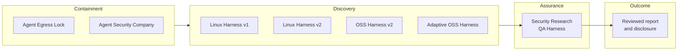

# Security Research QA Harness

[한국어](README.md) | [English](README.en.md)

[](https://github.com/foxirain/security-research-qa-harness/actions/workflows/ci.yml)

<p align="center"><strong>Research Assurance Tool · Internal Lineage: April 2026 · Public Consolidation: 26 August 2026</strong></p>

<p align="center"><strong>Core Philosophy — Evidence Before Severity</strong><br>Test candidates aggressively, but raise a claim only as far as reproduced evidence permits.</p>

> **Project status.** This repository consolidates two internal QA prototypes built to independently reproduce, falsify, and expand vulnerability-discovery results and inbound reports. It combines the executable engine from `poc_harness` with the evidence-led validation methodology from `poc-harness`. Neither source repository nor any private QA session was modified or copied into the public project.
>
> The harness does not autonomously confirm vulnerabilities or assign severity. A case file is an executable specification containing commands; a human must review it and run it only in an isolated environment. Final reachability, exploitability, affected-version, severity, and disclosure decisions remain human responsibilities.

## Abstract

**Abstract—** LLM-assisted vulnerability discovery can produce candidates quickly, but candidate rank, model confidence, or a single crash cannot establish a publishable security claim. `Security Research QA Harness` treats this gap as an **evidence-led research assurance** problem. It accepts a ranked Markdown report or an explicit TOML case and structures the claim, attacker starting position, entrypoint, attacker control, sink or invariant break, and blocking evidence. Target adapters and declarative replay convert file parsers, services, web/OpenAPI, gRPC, libraries, JNI, native harnesses, and CLI tools into a common execution contract. After a base replay, the harness can apply positive, negative, and stability controls plus bounded boundary variants, then collect runtime output, crash signals, artifacts, and step-output diffs. The result is separated into a technical report and an executive summary under an evidence ladder—`Confirmed`, `Supported`, `Unknown`, `Disproven`—and a severity-ceiling methodology. Command execution requires explicit acknowledgement, and configured credentials are redacted from stored commands and text output. The implementation is not an exploit generator, autonomous validator, or vulnerability-detection precision/recall benchmark.

**Index Terms—** vulnerability research, quality assurance, evidence ledger, controlled replay, negative control, boundary exploration, severity ceiling, defensive security.

## I. Portfolio Position

This project is the **independent QA and evidence-validation layer** after containment and discovery in the broader portfolio.



| Layer | Repository | Responsibility |
| --- | --- | --- |
| Containment | [Agent Egress Lock](https://github.com/foxirain/agent-egress-lock) | Early Docker, proxy, and host-firewall egress isolation |
| Containment | [Agent Security Company](https://github.com/foxirain/agent-security-company) | Linux identity, filesystem, network policy, and independent QA execution boundary |
| Discovery | [Linux Kernel Codex Harness](https://github.com/foxirain/linux-kernel-codex-harness) | Kernel review attention allocation |
| Discovery | [Linux Kernel Codex Harness v2](https://github.com/foxirain/linux-kernel-codex-harness-v2) | Provenance-aware finding triage |
| Discovery | [Codex OSS Vulnerability Harness v2](https://github.com/foxirain/codex-oss-vuln-harness-v2) | Multi-language External Signal workflow |
| Discovery | [Adaptive Codex OSS Vulnerability Harness](https://github.com/foxirain/codex-adaptive-oss-vuln-harness) | State-isolated adaptive search diversity |
| Assurance | **Security Research QA Harness** | Controlled reproduction, controls, evidence ledger, and claim ceiling |

Discovery repositories ask “where should we investigate?” This repository asks “how much of a discovered claim can the evidence support?” Its role also differs from the QA identity and policy boundary in Agent Security Company. The latter controls **who may run a validation with which privileges**; this repository implements **the evidence contract used to judge the result**.

## II. Evidence and Design Principles

### A. Execution Is Not Proof

A completed command, nonzero exit, crash string, or generated report is an observation. A report-grade claim still requires a real entrypoint, attacker control, a broken invariant or sensitive sink, a concrete consequence, and a negative control.

### B. Evidence Ladder

| Grade | Meaning |
| --- | --- |
| `Confirmed` | Runtime or artifact evidence directly establishes the chain step |
| `Supported` | Evidence makes the step credible, but a decisive artifact is missing |
| `Unknown` | Current evidence neither establishes nor falsifies the step |
| `Disproven` | A required path, trigger, sink, or boundary did not hold |

### C. Severity Ceiling

Every finding is constrained by three statements:

1. the strongest claim defensible now;
2. a stronger but unproven claim;
3. the exact evidence gap blocking that stronger claim.

For example, generated-source injection may establish build-integrity risk without establishing RCE if trusted automatic build consumption and an execution trigger are missing. An ASan invalid read establishes a memory-safety defect and possibly a crash, not automatically an arbitrary-read or code-execution primitive.

### D. Controlled Expansion

The workflow does not stop at the base reproduction, but it also does not turn into blind fuzzing. One meaningful property at a time is varied to compare scope, privilege, parser mode, input size, protocol method, or artifact behavior.

### E. Negative Evidence Is First-Class

Failed hypotheses and controls that block stronger claims belong in the final report. They define the boundary of the surviving claim and make it more credible.

### F. Safe-by-Default Execution

- `validate` and default `triage-oss` do not execute target commands.
- `run` refuses to proceed without `--acknowledge-execution-risk`.
- Generated `triage-oss` cases run only when `--execute` is supplied.
- Configured bearer tokens, cookies, and header values are redacted from stored command/stdout/stderr and `analysis.json`.
- These controls are not a sandbox. Untrusted targets still require separate disposable containment.

## III. System Architecture

<p align="center">
  
</p>

<p align="center"><strong>Fig. 1.</strong> Candidates become evidence through replay and controls. Automated analysis helps set a severity ceiling, while final sign-off and disclosure remain a human boundary.</p>

**TABLE I — MAJOR MODULE RESPONSIBILITIES**

| Module | Responsibility |
| --- | --- |
| `config.py`, `models.py` | TOML case parsing, typed execution/evidence contracts, and redacted serialization |
| `adapters.py` | File parser, service, web/OpenAPI, gRPC, library, JNI, native harness, and CLI profiles |
| `replay.py`, `executor.py` | Declarative request commands, timeouts, text artifact capture, and credential redaction |
| `orchestration.py` | Setup, service lifecycle, health checks, and cleanup |
| `boundary.py`, `diffing.py` | Bounded variants and artifact/runtime/output comparison with the base replay |
| `analyzer.py`, `memory_lens.py` | ASan, UBSan, and SIGSEGV signals plus memory region, access, allocator, and adjacency cues |
| `collectors.py` | Language-aware runtime observations such as Go panics, JVM fatal logs, and Python tracebacks |
| `intake.py`, `oss_workflow.py` | Ranked Markdown normalization, repository profiles, draft cases, and optional execution |
| `reporting.py` | `analysis.json`, analyst reports, and executive summaries |

See [Architecture](docs/ARCHITECTURE.md) and [Methodology](docs/METHODOLOGY.md) for the full design.

## IV. Methodology

### A. Intake and Attack Board

Two input shapes are supported:

- explicit case: TOML defining report metadata, target, adapter, replay, variables, boundaries, and steps;
- ranked report: Markdown review summary with `S/A/B/C/D` sections.

Ranked reports are normalized and drafted in `S > A > B > C > D` order. Tier allocates QA effort; it is not vulnerability validity or final severity.

### B. Target Adapters

| Adapter | Preserved context |
| --- | --- |
| `file-parser` | Input file, sanitizer, parser mode, and crash artifacts |
| `service`, `web-app` | Startup, ports, health check, request, and service logs |
| `openapi` | Method, path, query, headers, body, and target URL |
| `grpc` | Service/method, metadata, reflection/proto, and request file |
| `library`, `native-harness` | Minimal caller, argv/env, symbols, and dump artifacts |
| `jni-library` | Java exception state and native crash evidence |
| `cli-tool` | Exact argv, cwd, input file, and traceback |

See the [Adapter Guide](docs/ADAPTERS.md) for detailed fields.

### C. Base Replay and Controls

A case may define expected exit codes, but `expected=true` does not mean a security claim is valid. The base run and its controls should use the same observation path.

Recommended controls:

- positive: retain the reported trigger condition;
- negative: remove only the suspected condition;
- stability: vary size or repetition while preserving security meaning.

### D. Boundary Axes

Supported axes:

- `env-set`
- `variable-set`
- `string-length`
- `file-append`
- `file-token-replace`
- `http-method`
- `http-header`
- `query-param`
- `argv-append`

`max_variants` and `combine_depth` bound the expansion budget.

### E. Evidence Collection and Diff

Each step records exit state, duration, redacted stdout/stderr, and declared artifact existence. Variants are compared with the base replay for:

- added or missing artifacts;
- added or missing runtime observations;
- changed exit state or stdout/stderr;
- changed memory-risk classification.

### F. Human Closure

After automated processing, a human still closes:

1. target provenance and affected version;
2. real attacker reachability and privileges;
3. interpretation of positive and negative controls;
4. the strongest defensible impact;
5. remediation validation;
6. coordinated disclosure and publication safety.

## V. Installation and Usage

### A. Requirements

- Python 3.11 or newer
- target-specific build and replay dependencies
- a credential-free disposable lab for untrusted targets

The Python runtime uses only the standard library.

### B. Installation

```bash
git clone https://github.com/foxirain/security-research-qa-harness.git
cd security-research-qa-harness

python3 -m venv .venv
source .venv/bin/activate
python -m pip install .
security-qa-harness --help
```

### C. Validate Without Execution

```bash
security-qa-harness validate examples/report-case.toml
```

### D. Run a Reviewed Case

`run` executes setup, start, replay, stop, and cleanup commands from TOML. Review the case and isolate the target before acknowledging execution.

```bash
security-qa-harness run examples/report-case.toml \
  --output-root /tmp/security-qa-runs \
  --acknowledge-execution-risk
```

The bundled demo only emits synthetic ASan-style output and contains no real vulnerability.

### E. Normalize a Ranked Report

```bash
security-qa-harness intake examples/ranked-report.md \
  --output-root /tmp/security-qa-intake \
  --tiers S,A,B \
  --top-n 5
```

### F. Draft OSS Cases First

Default `triage-oss` profiles the repository and writes case TOML without executing target commands.

```bash
security-qa-harness triage-oss examples/ranked-report.md \
  --repo /path/to/authorized/repository \
  --output-root /tmp/security-qa-oss \
  --top-n 3
```

After reviewing generated commands and artifact paths, execute only in a disposable lab:

```bash
security-qa-harness triage-oss examples/ranked-report.md \
  --repo /path/to/authorized/repository \
  --output-root /tmp/security-qa-oss \
  --top-n 3 \
  --execute
```

## VI. Output Contract

```text
runs/<report-id>-<UTC-timestamp>/
├── 01-<step>/
│   ├── stdout.txt
│   └── stderr.txt
├── boundary/
│   └── <variant>/
├── analysis.json
├── analysis.md
└── executive_summary.md
```

- `analysis.json`: structured evidence for post-processing;
- `analysis.md`: replay, crash/runtime signals, memory lens, boundaries, and next actions;
- `executive_summary.md`: confirmed impact, unproven claims, and immediate actions.

Raw binary artifacts are not automatically redacted. Follow [Publication Safety](docs/PUBLICATION_SAFETY.md) before release.

## VII. Verification and Lineage

CI runs unit tests and an installed-wheel smoke test on Python 3.11, 3.12, and 3.13. The pre-publication local audit passed **30 / 30 regression tests** and an installed-wheel smoke test. The suite covers:

- TOML parsing and adapter defaults;
- OpenAPI/gRPC declarative command generation;
- ASan/UBSan/SIGSEGV classification and memory-risk cues;
- boundary variants and artifact diffs;
- ranked-report normalization and dry-run OSS drafting;
- the explicit execution gate;
- credential redaction in logs and structured output;
- packaged CLI import and help.

These tests do not measure vulnerability-detection precision, recall, exploitability, or CVE discovery rate.

The public repository is a new lineage that selectively consolidates the current source of two internal prototypes; their Git histories are not merged. See [Project Lineage](docs/LINEAGE.md) for scope.

## VIII. Boundaries

- This project is not an autonomous vulnerability scanner.
- Ranked tier, model confidence, crash patterns, and priority are not vulnerability proof.
- Treat a case file as trusted code. An explicit execution flag does not provide a container or sandbox.
- The memory lens is an analyst cue, not an exploitability verdict.
- Auto-selected repository commands are heuristic and may not be finding-specific reproductions.
- A generated report does not establish affected versions, operational exposure, or disclosure readiness.
- Public examples are synthetic and contain no private QA session or unpublished finding.
- Historical CVE outcomes are not retroactively attributed to this exact public snapshot.

## IX. Repository Map

| Path | Purpose |
| --- | --- |
| `src/security_qa_harness/` | Executable QA engine |
| `examples/`, `fixtures/` | Synthetic cases, ranked intake, and demo target |
| `docs/methodology/` | Evidence ladder, expansion, intake, severity, and reporting rules |
| `docs/playbooks/` | Memory safety, parser DoS, and code-generation injection playbooks |
| `docs/ARCHITECTURE.md` | Processing stages and trust boundaries |
| `docs/VALIDATION.md` | Pre-publication test, build, and safety validation receipt |
| `docs/PUBLICATION_SAFETY.md` | Pre-publication redaction and disclosure checklist |
| `tests/` | Regression and safety contracts |

## License

Licensed under the [Apache License 2.0](LICENSE). Security issues should follow
the [Security Policy](SECURITY.md).
