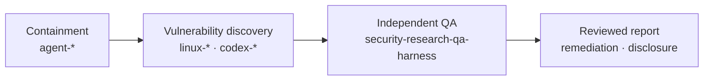

# Security Research QA Harness

[한국어](README.md) | [English](README.en.md)

[](https://github.com/foxirain/security-research-qa-harness/actions/workflows/ci.yml)

<p align="center"><strong>Research Tool · Internal Implementation: April 2026 · Public Consolidation: 26 August 2026</strong></p>

> **Project status.** This repository is a public consolidation of an internal QA implementation used for independent reproduction and impact validation of vulnerability reports. It combines the Python execution code from `poc_harness` with the validation procedure from `poc-harness`. Internal run records, unpublished vulnerability material, and the Git histories of the two source repositories are not included.

## Abstract

**Abstract—** Converting vulnerability-discovery output into a reportable finding requires more than a suspicious code location. The actual entrypoint, input conditions, reproduction result, controls, and affected boundary must also be established. `Security Research QA Harness` describes this process as a TOML case and executes it as a repeatable Python workflow. A case defines the target path, execution steps, environment, expected process states, collected files, and bounded input-variation axes. The executor runs a base case and selected variants, recording stdout, stderr, exit status, runtime signals, and declared artifacts. The analysis stage classifies ASan, UBSan, SIGSEGV, and language-specific runtime output, then compares each variant with the base case. Results are emitted as machine-readable JSON, a technical report, and a summary report. Command execution requires an explicit acknowledgement option, and authentication values configured in a case are removed from stored text output. The tool is neither an exploit generator nor an autonomous vulnerability classifier; impact and publication decisions require review of the collected material.

**Index Terms—** vulnerability validation, reproduction harness, quality assurance, runtime evidence, negative control, boundary testing.

## I. Introduction

Vulnerability-discovery output commonly mixes several kinds of information:

- a suspicious source path;
- an impact estimate that has not been executed;
- a crash or test failure that depends on environment;
- a reproduced security-boundary violation.

Without a separate validation record, a single crash can be assigned an unsupported impact, or a reproduced defect can be dismissed as an environment failure. This repository records the following in one execution model:

1. a base case for the reported behavior;
2. a control that removes or changes the suspected condition;
3. bounded variants of input, environment, or protocol state;
4. process state and runtime output for each execution;
5. artifact differences between the base case and variants;
6. demonstrated impact and impact that remains unverified.

## II. Portfolio Scope

This repository covers the validation stage after containment and vulnerability discovery.



**TABLE I — RELATED REPOSITORIES**

| Stage | Repository | Scope |
| --- | --- | --- |
| Containment | [Agent Egress Lock](https://github.com/foxirain/agent-egress-lock) | Early egress restriction using Docker, a proxy, and host firewall rules |
| Containment | [Agent Security Company](https://github.com/foxirain/agent-security-company) | Linux identity, filesystem and network policy, and a separate QA execution account |
| Discovery | [Linux Kernel Codex Harness](https://github.com/foxirain/linux-kernel-codex-harness) | Prioritization of Linux kernel review targets |
| Discovery | [Linux Kernel Codex Harness v2](https://github.com/foxirain/linux-kernel-codex-harness-v2) | Finding triage with repository provenance |
| Discovery | [Codex OSS Vulnerability Harness v2](https://github.com/foxirain/codex-oss-vuln-harness-v2) | Multi-language OSS target selection and review orchestration |
| Discovery | [Adaptive Codex OSS Vulnerability Harness](https://github.com/foxirain/codex-adaptive-oss-vuln-harness) | Execution and merge of isolated search sessions |
| Validation | **Security Research QA Harness** | Report intake, reproduction, controls, artifact comparison, and impact records |

`Agent Security Company` separates the QA worker's identity and execution privileges. This repository defines the individual validation cases and result format used within such an environment. The two projects cover the execution boundary and validation procedure respectively.

## III. System Architecture

<p align="center">
  
</p>

<p align="center"><strong>Fig. 1.</strong> A report and PoC are normalized into an executable case. Base replay, control, and variant results are collected before impact review.</p>

**TABLE II — MODULE RESPONSIBILITIES**

| Module | Responsibility |
| --- | --- |
| `config.py`, `models.py` | TOML parsing and report, target, replay, boundary, and result data models |
| `adapters.py` | File parser, service, OpenAPI, gRPC, library, JNI, native, and CLI presets |
| `replay.py` | Replay command generation from OpenAPI and gRPC metadata |
| `executor.py` | Command execution, timeout, stdout/stderr storage, and authentication-value removal |
| `orchestration.py` | Target setup, service start/stop, health checks, and cleanup |
| `boundary.py` | Generation and execution of bounded variants from declared axes |
| `diffing.py` | Comparison of output, runtime observations, and artifacts with the base case |
| `analyzer.py`, `memory_lens.py` | Classification of crash signals, access type, memory region, allocator state, and adjacency |
| `collectors.py` | Runtime output such as Go panics, JVM fatal logs, and Python tracebacks |
| `intake.py`, `oss_workflow.py` | Ranked Markdown normalization, repository profiles, and case drafts |
| `reporting.py` | JSON, technical Markdown, and summary output |

The processing stages are described in [Architecture](docs/ARCHITECTURE.md).

## IV. Case Definition

A case contains the following sections.

| Section | Content |
| --- | --- |
| `[report]` | Identifier, reported behavior, attack surface, exposure, and repeatability |
| `[target]` | Target name, root directory, setup, and cleanup commands |
| `[auth]` | Authentication mode, token, cookie, and headers |
| `[adapter]` | Product type, language, runtime, service, and artifact settings |
| `[replay]` | Custom command or OpenAPI/gRPC replay metadata |
| `[variables]` | Values used by commands and replay generation |
| `[boundary]` | Variant count and combination-depth limits |
| `[[boundary.axes]]` | Variable, file, environment, or protocol fields to change |
| `[[steps]]` | Commands, working directory, timeout, expected exit codes, and collection paths |

Supported adapters and examples are listed in the [Adapter Matrix](docs/ADAPTERS.md).

A case contains commands and must be reviewed as code. `validate` checks parsing and adapter application without executing target commands.

## V. Validation Procedure

### A. Base Replay

The base case reproduces the reporter's input and environment in the smallest practical sequence. Its record includes:

- the executed command and working directory;
- environment overrides;
- timeout and exit status;
- stdout and stderr;
- declared artifacts confirmed to exist.

`expected_exit_codes` distinguishes harness execution state. Observing one of those codes does not itself confirm a vulnerability.

### B. Controls

The same observation path is used to compare the following cases.

| Control | Purpose |
| --- | --- |
| Positive | Check that the reported behavior occurs under the reported condition |
| Negative | Check that the behavior disappears when the suspected input or state is removed |
| Stability | Check whether the result persists across repetition or size changes |

Controls can be represented as separate steps or boundary axes.

### C. Boundary Variants

Supported axes are:

- `env-set`
- `variable-set`
- `string-length`
- `file-append`
- `file-token-replace`
- `http-method`
- `http-header`
- `query-param`
- `argv-append`

`max_variants` limits total executions, and `combine_depth` controls whether two axes are combined. This function does not replace general fuzzing; it compares conditions close to the base case.

### D. Runtime Classification

The current analyzer classifies:

- AddressSanitizer memory errors and READ/WRITE access;
- UBSan runtime errors;
- SIGSEGV without a sanitizer classification;
- stack, heap, and global memory regions;
- freed allocations and left/right object adjacency;
- Go panics, JVM fatal errors, Python tracebacks, and other language-specific runtime markers.

Memory classification identifies material for follow-up review. It does not determine arbitrary read/write or code-execution feasibility.

### E. Result Comparison

Each variant is compared with the base case for:

- artifacts added or removed;
- runtime observations added or removed;
- steps with changed stdout/stderr or exit state;
- changes in crash and memory classification.

Reports separate demonstrated behavior from material still required for a stronger impact assessment. Detailed criteria are documented in [Methodology](docs/METHODOLOGY.md) and the bug-class [Playbooks](docs/playbooks/).

## VI. Installation and Usage

### A. Requirements

- Python 3.11 or newer
- target-specific build and runtime dependencies
- a separate isolated environment for untrusted input

The Python runtime uses only the standard library.

### B. Installation

```bash
git clone https://github.com/foxirain/security-research-qa-harness.git
cd security-research-qa-harness

python3 -m venv .venv
source .venv/bin/activate
python -m pip install .
security-qa-harness --help
```

### C. Case Validation

```bash
security-qa-harness validate examples/report-case.toml
```

### D. Case Execution

```bash
security-qa-harness run examples/report-case.toml \
  --output-root /tmp/security-qa-runs \
  --acknowledge-execution-risk
```

`--acknowledge-execution-risk` explicitly records that the commands in the case were reviewed. It does not create a sandbox. The bundled `report-case.toml` and `demo_target.py` are functional examples that emit synthetic ASan output.

### E. Ranked Report Intake

```bash
security-qa-harness intake examples/ranked-report.md \
  --output-root /tmp/security-qa-intake \
  --tiers S,A,B \
  --top-n 5
```

### F. OSS Case Draft

Default `triage-oss` creates a repository profile and case drafts without executing generated commands.

```bash
security-qa-harness triage-oss examples/ranked-report.md \
  --repo /path/to/authorized/repository \
  --output-root /tmp/security-qa-oss \
  --top-n 3
```

Add `--execute` only after reviewing the drafts.

## VII. Output

```text
runs/<report-id>-<UTC-timestamp>/
├── 01-<step>/
│   ├── stdout.txt
│   └── stderr.txt
├── boundary/
│   └── <variant>/
├── analysis.json
├── analysis.md
└── executive_summary.md
```

| File | Content |
| --- | --- |
| `analysis.json` | Report, step, signal, variant, and impact data |
| `analysis.md` | Execution results, runtime evidence, boundary comparison, and follow-up checks |
| `executive_summary.md` | Short separation of demonstrated and unverified impact |

Configured bearer tokens, cookies, and header values are replaced with `[REDACTED]` in stored commands and text output. Arbitrary binary or external artifacts selected for collection are not inspected automatically. Apply [Publication Safety](docs/PUBLICATION_SAFETY.md) before release.

## VIII. Verification

The pre-publication validation on 26 August 2026 produced the following results.

- regression tests: **30 / 30 passed**
- Python 3.12 local compilation: passed
- PEP 517 wheel build: passed
- clean virtual-environment install and CLI smoke test: passed
- GitHub Actions on Python 3.11, 3.12, and 3.13: passed

Regression tests cover case parsing, adapters, replay commands, crash classification, boundary variants, artifact diffs, ranked intake, execution acknowledgement, and authentication-value removal. They do not measure vulnerability-detection accuracy or exploitability.

Commands and claim boundaries are recorded in the [Validation Receipt](docs/VALIDATION.md).

## IX. Limitations

- The harness does not determine whether a case file or target command is safe.
- Execution acknowledgement does not provide a container, VM, or network isolation.
- An automatically selected repository command may not be a finding-specific reproducer.
- Crash-pattern classification does not replace exploitability analysis.
- Collected artifacts are not automatically assessed for disclosure suitability.
- Public examples contain no private QA session or unpublished finding.
- No historical CVE is attributed to this public snapshot.

## X. Repository Map

| Path | Purpose |
| --- | --- |
| `src/security_qa_harness/` | Python package and CLI |
| `examples/`, `fixtures/` | Synthetic cases, ranked report, and demo target |
| `docs/ARCHITECTURE.md` | Execution stages and trust boundaries |
| `docs/METHODOLOGY.md` | Report intake, controls, and impact-recording procedure |
| `docs/methodology/` | Evidence ladder, expansion, severity, and report documents |
| `docs/playbooks/` | Review items for memory safety, parser DoS, and code-generation injection |
| `docs/PUBLICATION_SAFETY.md` | Artifact review before publication |
| `docs/VALIDATION.md` | Test, build, and installation record |
| `tests/` | Regression suite |

The relationship between this public repository and the internal prototypes is documented in [Project Lineage](docs/LINEAGE.md).

## License

Licensed under the [Apache License 2.0](LICENSE). Security issues should follow the [Security Policy](SECURITY.md).
