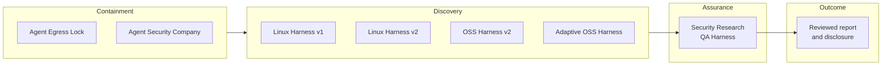

# Security Research QA Harness

[한국어](README.md) | [English](README.en.md)

[](https://github.com/foxirain/security-research-qa-harness/actions/workflows/ci.yml)

<p align="center"><strong>Research Assurance Tool · Internal Lineage: April 2026 · Public Consolidation: 26 August 2026</strong></p>

<p align="center"><strong>Core Philosophy — Evidence Before Severity</strong><br>후보는 공격적으로 검증하되, 주장은 재현된 증거가 허용하는 경계까지만 올린다.</p>

> **Project status.** 이 저장소는 취약점 탐색 결과와 외부 보고를 독립적으로 재현·반증·확장하기 위해 구축한 두 내부 QA prototype을 하나의 공개 포트폴리오로 정리한다. `poc_harness`의 실행 엔진과 `poc-harness`의 evidence-led validation 방법론을 결합했으며, 원본 저장소와 실제 비공개 QA session은 변경하거나 복사하지 않았다.
>
> 이 하네스는 취약점을 자동으로 확정하거나 severity를 자동 산정하지 않는다. Case file은 명령을 포함하는 실행 명세이므로 사람이 검토한 뒤 격리된 환경에서만 실행해야 한다. 최종 reachability, exploitability, affected version, severity와 disclosure 판단은 사람의 책임이다.

## Abstract

**Abstract—** LLM-assisted vulnerability discovery는 많은 후보를 빠르게 만들 수 있지만, 후보 순위·모델 confidence·단일 crash만으로 공개 가능한 보안 주장을 만들 수는 없다. `Security Research QA Harness`는 이 간극을 **evidence-led research assurance** 문제로 정의한다. Ranked Markdown 또는 명시적 TOML case를 입력으로 받아 주장, 공격자 시작점, entrypoint, attacker control, sink 또는 invariant break와 blocking evidence를 구조화한다. Target adapter와 declarative replay는 file parser, service, web/OpenAPI, gRPC, library, JNI, native harness와 CLI 환경을 공통 실행 계약으로 변환한다. Base replay 뒤에는 positive·negative·stability control 및 제한된 boundary variant를 수행하고, runtime output, crash signal, artifact와 step-output diff를 수집한다. 분석 결과는 `Confirmed`, `Supported`, `Unknown`, `Disproven` evidence ladder와 severity ceiling 방법론에 따라 기술 보고서와 executive summary로 분리된다. 명령 실행은 명시적 승인 없이는 시작되지 않고, 설정된 credential은 저장되는 명령과 text output에서 redaction된다. 이 구현은 exploit generator, autonomous validator 또는 vulnerability-detection precision/recall benchmark가 아니다.

**Index Terms—** vulnerability research, quality assurance, evidence ledger, controlled replay, negative control, boundary exploration, severity ceiling, defensive security.

## I. Portfolio Position

이 프로젝트는 기존 포트폴리오의 sandbox와 discovery 다음에 위치하는 **독립 QA·증거 검증 계층**이다.



| Layer | Repository | Responsibility |
| --- | --- | --- |
| Containment | [Agent Egress Lock](https://github.com/foxirain/agent-egress-lock) | 초기 Docker·proxy·host-firewall egress isolation |
| Containment | [Agent Security Company](https://github.com/foxirain/agent-security-company) | Linux identity, filesystem, network policy와 independent QA execution boundary |
| Discovery | [Linux Kernel Codex Harness](https://github.com/foxirain/linux-kernel-codex-harness) | Kernel review attention allocation |
| Discovery | [Linux Kernel Codex Harness v2](https://github.com/foxirain/linux-kernel-codex-harness-v2) | Provenance-aware finding triage |
| Discovery | [Codex OSS Vulnerability Harness v2](https://github.com/foxirain/codex-oss-vuln-harness-v2) | Multi-language External Signal workflow |
| Discovery | [Adaptive Codex OSS Vulnerability Harness](https://github.com/foxirain/codex-adaptive-oss-vuln-harness) | State-isolated adaptive search diversity |
| Assurance | **Security Research QA Harness** | Controlled reproduction, controls, evidence ledger와 claim ceiling |

Discovery repository는 “어디를 조사할 것인가”를 다룬다. 이 저장소는 “발견된 주장을 어디까지 믿을 수 있는가”를 다룬다. Agent Security Company의 QA identity·policy boundary와도 역할이 다르다. 전자는 **누가 어떤 권한으로 검증을 실행하는가**, 이 저장소는 **어떤 증거 계약으로 결과를 판정하는가**를 구현한다.

## II. Evidence and Design Principles

### A. Execution Is Not Proof

명령이 종료됐다는 사실, nonzero exit, crash 문자열 또는 생성된 report는 각각 관찰값일 뿐이다. Report-grade claim에는 실제 entrypoint, attacker control, broken invariant 또는 sink, concrete consequence와 negative control이 필요하다.

### B. Evidence Ladder

| Grade | Meaning |
| --- | --- |
| `Confirmed` | Runtime 또는 artifact가 chain step을 직접 입증 |
| `Supported` | 강하게 뒷받침하지만 결정적 artifact가 부족 |
| `Unknown` | 현재 증거로 확인하거나 반증할 수 없음 |
| `Disproven` | 필요한 path, trigger, sink 또는 boundary가 성립하지 않음 |

### C. Severity Ceiling

각 finding은 세 문장으로 제한한다.

1. 현재 증거로 방어 가능한 최대 claim
2. 더 강하지만 아직 증명되지 않은 claim
3. 그 claim을 막는 정확한 evidence gap

예를 들어 generated-source injection은 build-integrity risk를 입증할 수 있지만, trusted automatic build consumption과 execution trigger가 없으면 RCE를 입증하지 않는다. ASan invalid read는 memory-safety defect와 crash를 입증할 수 있지만 arbitrary read 또는 code execution을 자동으로 입증하지 않는다.

### D. Controlled Expansion

Base reproduction에서 멈추지 않되 blind fuzzing으로 확장하지 않는다. 한 번에 하나의 의미 있는 축을 변경해 scope, privilege, parser mode, input size, protocol method 또는 artifact behavior가 어떻게 바뀌는지 비교한다.

### E. Negative Evidence Is First-Class

실패한 가설과 stronger claim을 막은 control을 최종 보고서에 남긴다. 이는 결과를 약하게 만드는 것이 아니라 surviving claim의 정확한 경계를 만든다.

### F. Safe-by-Default Execution

- `validate`와 기본 `triage-oss`는 target command를 실행하지 않는다.
- `run`은 `--acknowledge-execution-risk` 없이는 거부된다.
- `triage-oss`가 생성한 case는 `--execute`를 명시해야 실행된다.
- Configured bearer token, cookie와 header value는 저장되는 command/stdout/stderr와 `analysis.json`에서 redaction된다.
- 이 장치는 sandbox가 아니다. 신뢰할 수 없는 target은 별도 disposable containment에서 실행해야 한다.

## III. System Architecture

<p align="center">
  
</p>

<p align="center"><strong>Fig. 1.</strong> 후보는 replay와 control을 통해 evidence로 변환된다. 자동 분석은 severity ceiling을 보조하지만 최종 sign-off와 disclosure는 사람의 경계로 남는다.</p>

**TABLE I — MAJOR MODULE RESPONSIBILITIES**

| Module | Responsibility |
| --- | --- |
| `config.py`, `models.py` | TOML case parsing, typed execution·evidence contract와 redacted serialization |
| `adapters.py` | File parser, service, web/OpenAPI, gRPC, library, JNI, native harness, CLI profile |
| `replay.py`, `executor.py` | Declarative request command, timeout, text artifact capture와 credential redaction |
| `orchestration.py` | Setup, service lifecycle, healthcheck와 cleanup |
| `boundary.py`, `diffing.py` | 제한된 variant 생성과 base replay 대비 artifact·runtime·output diff |
| `analyzer.py`, `memory_lens.py` | ASan·UBSan·SIGSEGV signal, memory region, access, allocator와 adjacency cue |
| `collectors.py` | Go panic, JVM fatal log, Python traceback 등 language-aware runtime observation |
| `intake.py`, `oss_workflow.py` | Ranked Markdown 정규화, repository profile, draft case와 optional execution |
| `reporting.py` | `analysis.json`, analyst report와 executive summary |

상세 설계는 [Architecture](docs/ARCHITECTURE.md), 전체 방법은 [Methodology](docs/METHODOLOGY.md)에서 설명한다.

## IV. Methodology

### A. Intake and Attack Board

두 입력 형식을 지원한다.

- 명시적 case: report metadata, target, adapter, replay, variable, boundary와 step을 정의한 TOML
- Ranked report: `S/A/B/C/D` section을 가진 Markdown review summary

Ranked report는 finding을 정규화하고 `S > A > B > C > D` 순서로 draft를 생성한다. Tier는 QA 예산 배분이며 vulnerability validity 또는 최종 severity가 아니다.

### B. Target Adapters

| Adapter | Preserved context |
| --- | --- |
| `file-parser` | Input file, sanitizer, parser mode, crash artifact |
| `service`, `web-app` | Startup, ports, healthcheck, request and service logs |
| `openapi` | Method, path, query, headers, body and target URL |
| `grpc` | Service/method, metadata, reflection/proto and request file |
| `library`, `native-harness` | Minimal caller, argv/env, symbols and dump artifacts |
| `jni-library` | Java exception state and native crash evidence |
| `cli-tool` | Exact argv, cwd, input file and traceback |

Adapter 상세 필드는 [Adapter Guide](docs/ADAPTERS.md)에 있다.

### C. Base Replay and Controls

Case는 expected exit code를 성공으로 간주할 수 있지만, `expected=true`는 보안 주장이 맞다는 뜻이 아니다. Base run과 control은 같은 observation path를 사용해야 한다.

권장 control:

- positive: 보고된 조건을 유지한 재현
- negative: 의심한 조건만 제거
- stability: 동일 의미를 유지하며 입력 크기 또는 실행 횟수 변화

### D. Boundary Axes

지원되는 axis:

- `env-set`
- `variable-set`
- `string-length`
- `file-append`
- `file-token-replace`
- `http-method`
- `http-header`
- `query-param`
- `argv-append`

`max_variants`와 `combine_depth`가 expansion budget을 제한한다.

### E. Evidence Collection and Diff

각 step은 exit code, duration, redacted stdout/stderr와 declared artifact existence를 기록한다. Variant는 base replay와 다음을 비교한다.

- 새로 생기거나 사라진 artifact
- 새로 생기거나 사라진 runtime observation
- exit code 또는 stdout/stderr가 달라진 step
- memory-risk classification 변화

### F. Human Closure

자동 결과 뒤에는 사람이 다음을 닫아야 한다.

1. target provenance와 affected version
2. 실제 attacker reachability와 privileges
3. positive·negative control의 해석
4. 가장 강한 defensible impact
5. remediation 확인
6. coordinated disclosure와 publication safety

## V. Installation and Usage

### A. Requirements

- Python 3.11 이상
- 실제 target build/replay에 필요한 project-specific dependency
- 신뢰할 수 없는 target을 위한 credential-free disposable lab

Runtime Python dependency는 표준 라이브러리뿐이다.

### B. Installation

```bash
git clone https://github.com/foxirain/security-research-qa-harness.git
cd security-research-qa-harness

python3 -m venv .venv
source .venv/bin/activate
python -m pip install .
security-qa-harness --help
```

### C. Validate Without Execution

```bash
security-qa-harness validate examples/report-case.toml
```

### D. Run a Reviewed Case

`run`은 TOML의 setup, start, replay, stop과 cleanup command를 실행한다. 먼저 case와 target을 검토하고 격리한 뒤 명시적으로 승인한다.

```bash
security-qa-harness run examples/report-case.toml \
  --output-root /tmp/security-qa-runs \
  --acknowledge-execution-risk
```

기본 예제는 synthetic ASan-style output만 생성하며 실제 취약점을 포함하지 않는다.

### E. Normalize a Ranked Report

```bash
security-qa-harness intake examples/ranked-report.md \
  --output-root /tmp/security-qa-intake \
  --tiers S,A,B \
  --top-n 5
```

### F. Draft OSS Cases First

기본 `triage-oss`는 repository를 profile하고 case TOML을 생성하지만 target command를 실행하지 않는다.

```bash
security-qa-harness triage-oss examples/ranked-report.md \
  --repo /path/to/authorized/repository \
  --output-root /tmp/security-qa-oss \
  --top-n 3
```

생성된 command와 artifact path를 검토한 뒤 disposable lab에서만 실행한다.

```bash
security-qa-harness triage-oss examples/ranked-report.md \
  --repo /path/to/authorized/repository \
  --output-root /tmp/security-qa-oss \
  --top-n 3 \
  --execute
```

## VI. Output Contract

```text
runs/<report-id>-<UTC-timestamp>/
├── 01-<step>/
│   ├── stdout.txt
│   └── stderr.txt
├── boundary/
│   └── <variant>/
├── analysis.json
├── analysis.md
└── executive_summary.md
```

- `analysis.json`: 후처리 가능한 structured evidence
- `analysis.md`: replay, crash/runtime signal, memory lens, boundary와 next action
- `executive_summary.md`: confirmed impact, unproven claims와 immediate action

Raw binary artifact는 자동 redaction되지 않는다. 공개 전 [Publication Safety](docs/PUBLICATION_SAFETY.md)를 따른다.

## VII. Verification and Lineage

CI는 Python 3.11, 3.12, 3.13에서 unit test와 installed-wheel smoke test를 수행한다. 공개 전 로컬 audit에서 **30 / 30 regression test**와 wheel 설치 smoke test가 통과했다. Regression suite는 다음 software contract를 확인한다.

- TOML parsing과 adapter default
- OpenAPI/gRPC declarative command generation
- ASan·UBSan·SIGSEGV classification과 memory-risk cue
- boundary variant와 artifact diff
- ranked-report normalization과 dry-run OSS drafting
- explicit execution gate
- credential redaction in logs and structured output
- packaged CLI import와 help

이 테스트는 vulnerability detection precision, recall, exploitability 또는 CVE discovery rate를 측정하지 않는다.

공개 repository는 두 내부 prototype의 current source를 선택적으로 통합한 새 lineage이며 원본 Git history를 병합하지 않는다. 자세한 범위는 [Project Lineage](docs/LINEAGE.md)를 참고한다.

## VIII. Boundaries

- 이 프로젝트는 autonomous vulnerability scanner가 아니다.
- Ranked tier, model confidence, crash pattern과 priority는 vulnerability proof가 아니다.
- Case file은 신뢰된 code처럼 review해야 한다. 명시적 실행 flag는 container나 sandbox를 제공하지 않는다.
- Memory lens는 analyst cue이며 exploitability verdict가 아니다.
- Auto-selected repository command는 heuristic이고 finding-specific reproduction이 아닐 수 있다.
- Generated report는 affected version, operational exposure 또는 disclosure readiness를 자동 증명하지 않는다.
- 공개 예제는 synthetic이며 실제 비공개 QA session이나 unpublished finding을 포함하지 않는다.
- 이 exact public snapshot에 과거 CVE outcome을 사후 귀속하지 않는다.

## IX. Repository Map

| Path | Purpose |
| --- | --- |
| `src/security_qa_harness/` | 실행 가능한 QA engine |
| `examples/`, `fixtures/` | Synthetic case, ranked intake와 demo target |
| `docs/methodology/` | Evidence ladder, expansion, intake, severity와 reporting rules |
| `docs/playbooks/` | Memory safety, parser DoS와 code-generation injection playbook |
| `docs/ARCHITECTURE.md` | Processing stage와 trust boundary |
| `docs/VALIDATION.md` | 공개 전 test·build·safety validation receipt |
| `docs/PUBLICATION_SAFETY.md` | 공개 전 redaction·disclosure checklist |
| `tests/` | Regression and safety contract |

## License

Licensed under the [Apache License 2.0](LICENSE). Security issues should follow
the [Security Policy](SECURITY.md).
