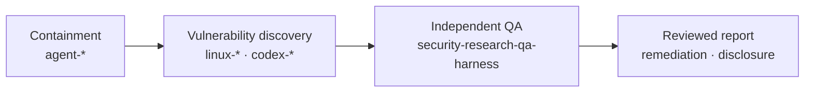

# Security Research QA Harness

[한국어](README.md) | [English](README.en.md)

[](https://github.com/foxirain/security-research-qa-harness/actions/workflows/ci.yml)

<p align="center"><strong>Research Tool · Internal Implementation: April 2026 · Public Consolidation: 26 August 2026</strong></p>

> **Project status.** 이 저장소는 취약점 보고서의 독립 재현과 영향 검증에 사용한 내부 QA 구현을 공개용으로 정리한 것이다. `poc_harness`의 Python 실행 코드와 `poc-harness`의 검증 절차 문서를 통합했다. 내부 실행 기록, 미공개 취약점 자료와 기존 두 저장소의 Git 이력은 포함하지 않는다.

## Abstract

**Abstract—** 취약점 탐색 결과를 보고 가능한 finding으로 확정하려면 코드상의 의심 지점 외에도 실제 entrypoint, 입력 조건, 재현 결과, 대조군 및 영향 범위가 필요하다. `Security Research QA Harness`는 이 검증 과정을 TOML case로 기술하고 반복 실행하는 Python 도구다. Case는 대상 경로, 실행 단계, 환경 변수, 예상 종료 상태, 수집할 파일과 입력 변형 축을 정의한다. 실행기는 base case와 제한된 variant를 수행하고 stdout, stderr, 종료 코드, runtime signal과 지정된 artifact를 기록한다. 분석 단계는 ASan·UBSan·SIGSEGV 및 언어별 runtime output을 분류하고, variant 결과를 base case와 비교한다. 출력은 machine-readable JSON, 기술 보고서와 요약 보고서로 나뉜다. 명령 실행에는 별도의 승인 option이 필요하며 case에 설정된 인증값은 저장되는 text output에서 제거된다. 이 도구는 exploit 생성기나 취약점 자동 판정기가 아니며, 최종 영향과 공개 여부는 수집된 자료를 검토한 뒤 결정해야 한다.

**Index Terms—** vulnerability validation, reproduction harness, quality assurance, runtime evidence, negative control, boundary testing.

## I. Introduction

취약점 탐색 단계에서 얻은 결과에는 서로 다른 수준의 정보가 섞여 있다.

- 코드에서 확인한 의심 경로
- 실행하지 않은 영향 추정
- 환경에 따라 달라지는 crash 또는 test failure
- 실제로 재현된 보안 경계 위반

이들을 구분하지 않으면 단일 crash가 과도한 영향으로 해석되거나, 반대로 재현된 문제가 환경 오류로 처리될 수 있다. 이 저장소는 다음 항목을 동일한 실행 기록 안에 남기는 것을 목적으로 한다.

1. 보고된 동작을 실행하는 base case
2. 의심 조건을 제거하거나 변경한 control
3. 입력·환경·protocol 조건을 제한적으로 변경한 variant
4. 각 실행의 종료 상태와 runtime output
5. base case와 variant 사이의 artifact 차이
6. 확인된 영향과 아직 확인하지 못한 영향

## II. Portfolio Scope

이 저장소는 containment와 vulnerability discovery 이후의 검증 단계에 해당한다.



**TABLE I — RELATED REPOSITORIES**

| Stage | Repository | Scope |
| --- | --- | --- |
| Containment | [Agent Egress Lock](https://github.com/foxirain/agent-egress-lock) | Docker, proxy와 host firewall을 이용한 초기 egress 제한 |
| Containment | [Agent Security Company](https://github.com/foxirain/agent-security-company) | Linux identity, filesystem, network policy와 분리된 QA 실행 계정 |
| Discovery | [Linux Kernel Codex Harness](https://github.com/foxirain/linux-kernel-codex-harness) | Linux kernel 조사 대상 우선순위화 |
| Discovery | [Linux Kernel Codex Harness v2](https://github.com/foxirain/linux-kernel-codex-harness-v2) | Repository provenance를 포함한 finding triage |
| Discovery | [Codex OSS Vulnerability Harness v2](https://github.com/foxirain/codex-oss-vuln-harness-v2) | 여러 언어의 OSS 조사 대상 선정과 검토 orchestration |
| Discovery | [Adaptive Codex OSS Vulnerability Harness](https://github.com/foxirain/codex-adaptive-oss-vuln-harness) | 분리된 여러 search session의 실행과 병합 |
| Validation | **Security Research QA Harness** | Report intake, 재현, control, artifact 비교와 영향 기록 |

`Agent Security Company`는 QA 작업의 identity와 실행 권한을 분리한다. 이 저장소는 그 환경 안에서 수행할 개별 검증 case와 결과 형식을 정의한다. 두 프로젝트는 각각 execution boundary와 validation procedure를 담당한다.

## III. System Architecture

<p align="center">
  
</p>

<p align="center"><strong>Fig. 1.</strong> Report와 PoC를 실행 가능한 case로 정규화한 뒤 base replay, control과 variant 결과를 수집한다. 영향 평가는 이 실행 자료와 별도의 검토를 함께 사용한다.</p>

**TABLE II — MODULE RESPONSIBILITIES**

| Module | Responsibility |
| --- | --- |
| `config.py`, `models.py` | TOML parsing과 report, target, replay, boundary, result data model |
| `adapters.py` | File parser, service, OpenAPI, gRPC, library, JNI, native와 CLI preset |
| `replay.py` | OpenAPI와 gRPC metadata에서 replay command 생성 |
| `executor.py` | Command 실행, timeout, stdout/stderr 저장과 인증값 제거 |
| `orchestration.py` | Target setup, service start/stop, health check와 cleanup |
| `boundary.py` | 선언된 axis로 제한된 variant 생성 및 실행 |
| `diffing.py` | Base case와 variant의 output, runtime observation과 artifact 비교 |
| `analyzer.py`, `memory_lens.py` | Crash signal, access type, memory region, allocator state와 adjacency 분류 |
| `collectors.py` | Go panic, JVM fatal log, Python traceback 등 runtime output 수집 |
| `intake.py`, `oss_workflow.py` | Ranked Markdown 정규화, repository profile과 case draft 생성 |
| `reporting.py` | JSON, technical Markdown와 executive summary 출력 |

상세 구조는 [Architecture](docs/ARCHITECTURE.md)에 정리되어 있다.

## IV. Case Definition

Case는 다음 영역으로 구성된다.

| Section | Content |
| --- | --- |
| `[report]` | 식별자, 보고된 내용, attack surface, exposure와 재현성 |
| `[target]` | 대상 이름, root directory, setup과 cleanup command |
| `[auth]` | 인증 방식, token, cookie와 header |
| `[adapter]` | 제품 유형, 언어, runtime, service와 artifact 설정 |
| `[replay]` | Custom command 또는 OpenAPI/gRPC replay metadata |
| `[variables]` | Command와 replay에서 사용할 값 |
| `[boundary]` | Variant 수와 조합 깊이 제한 |
| `[[boundary.axes]]` | 변경할 변수, 파일, 환경 또는 protocol field |
| `[[steps]]` | 실행 명령, working directory, timeout, 예상 종료 코드와 수집 경로 |

지원 adapter와 예제는 [Adapter Matrix](docs/ADAPTERS.md)에 있다.

Case 파일은 실행할 명령을 포함하므로 코드와 같은 수준으로 검토해야 한다. `validate`는 형식과 adapter 적용만 확인하며 target command를 실행하지 않는다.

## V. Validation Procedure

### A. Base Replay

Base case는 보고자가 제시한 입력과 환경을 가능한 한 적은 단계로 재현한다. 다음 값이 실행 기록에 포함된다.

- 실제 실행 명령과 working directory
- environment override
- timeout과 종료 코드
- stdout과 stderr
- 존재가 확인된 declared artifact

`expected_exit_codes`는 harness 실행의 성공 여부를 구분하기 위한 값이다. 해당 종료 코드가 나왔다는 사실만으로 취약점이 확인되는 것은 아니다.

### B. Controls

동일한 관찰 경로에서 다음 case를 비교한다.

| Control | Purpose |
| --- | --- |
| Positive | 보고된 조건에서 동일한 동작이 발생하는지 확인 |
| Negative | 의심한 입력 또는 상태를 제거했을 때 동작이 사라지는지 확인 |
| Stability | 반복 실행 또는 크기 변화에서 결과가 유지되는지 확인 |

Control은 별도 step 또는 boundary axis로 표현할 수 있다.

### C. Boundary Variants

지원되는 axis는 다음과 같다.

- `env-set`
- `variable-set`
- `string-length`
- `file-append`
- `file-token-replace`
- `http-method`
- `http-header`
- `query-param`
- `argv-append`

`max_variants`는 전체 실행 수를 제한하고 `combine_depth`는 두 axis의 조합 여부를 결정한다. 이 기능은 일반 fuzzing을 대신하지 않으며, base case와 가까운 조건 변화를 비교하기 위한 것이다.

### D. Runtime Classification

현재 분석기는 다음 자료를 분류한다.

- AddressSanitizer memory error와 READ/WRITE access
- UBSan runtime error
- sanitizer classification이 없는 SIGSEGV
- stack, heap, global memory region
- freed allocation 및 object 좌우 adjacency
- Go panic, JVM fatal error, Python traceback과 기타 언어별 runtime marker

Memory classification은 후속 검토 대상을 정리하는 데 사용한다. 임의 읽기·쓰기나 code execution 가능성을 자동으로 판정하지 않는다.

### E. Result Comparison

Variant마다 base case와 다음 항목을 비교한다.

- 새로 생성되거나 사라진 artifact
- 추가되거나 사라진 runtime observation
- stdout/stderr 또는 종료 코드가 달라진 step
- crash 및 memory classification 변화

보고서에는 확인된 결과와 더 강한 영향을 판단하기 위해 부족한 자료를 분리해 기록한다. 세부 기준은 [Methodology](docs/METHODOLOGY.md)와 bug class별 [Playbooks](docs/playbooks/)에 있다.

## VI. Installation and Usage

### A. Requirements

- Python 3.11 이상
- 대상 project의 build 및 실행 dependency
- 신뢰할 수 없는 입력을 실행할 별도의 격리 환경

Python runtime dependency는 표준 라이브러리뿐이다.

### B. Installation

```bash
git clone https://github.com/foxirain/security-research-qa-harness.git
cd security-research-qa-harness

python3 -m venv .venv
source .venv/bin/activate
python -m pip install .
security-qa-harness --help
```

### C. Case Validation

```bash
security-qa-harness validate examples/report-case.toml
```

### D. Case Execution

```bash
security-qa-harness run examples/report-case.toml \
  --output-root /tmp/security-qa-runs \
  --acknowledge-execution-risk
```

`--acknowledge-execution-risk`는 case에 포함된 명령을 검토했다는 명시적 표시다. 별도의 sandbox를 생성하지는 않는다. 포함된 `report-case.toml`과 `demo_target.py`는 synthetic ASan output을 사용하는 기능 예제다.

### E. Ranked Report Intake

```bash
security-qa-harness intake examples/ranked-report.md \
  --output-root /tmp/security-qa-intake \
  --tiers S,A,B \
  --top-n 5
```

### F. OSS Case Draft

기본 `triage-oss`는 repository profile과 case draft만 만들고 생성한 command를 실행하지 않는다.

```bash
security-qa-harness triage-oss examples/ranked-report.md \
  --repo /path/to/authorized/repository \
  --output-root /tmp/security-qa-oss \
  --top-n 3
```

Draft를 검토한 뒤 같은 workflow에서 실행하려면 `--execute`를 추가한다.

## VII. Output

```text
runs/<report-id>-<UTC-timestamp>/
├── 01-<step>/
│   ├── stdout.txt
│   └── stderr.txt
├── boundary/
│   └── <variant>/
├── analysis.json
├── analysis.md
└── executive_summary.md
```

| File | Content |
| --- | --- |
| `analysis.json` | Report, step, signal, variant와 impact data |
| `analysis.md` | 실행 결과, runtime evidence, boundary comparison과 후속 확인 항목 |
| `executive_summary.md` | 확인된 영향과 아직 확인되지 않은 영향의 짧은 요약 |

설정된 bearer token, cookie와 header value는 저장되는 명령과 text output에서 `[REDACTED]`로 치환된다. 수집 대상에 포함된 임의의 binary 또는 외부 artifact는 자동으로 검사하지 않는다. 공개 전 [Publication Safety](docs/PUBLICATION_SAFETY.md)를 별도로 적용해야 한다.

## VIII. Verification

2026년 8월 26일 공개 전 검증에서 다음 결과를 확인했다.

- regression test: **30 / 30 passed**
- Python 3.12 local compile: passed
- PEP 517 wheel build: passed
- clean virtual environment install 및 CLI smoke test: passed
- GitHub Actions Python 3.11, 3.12, 3.13: passed

Regression test는 case parsing, adapter, replay command, crash 분류, boundary variant, artifact diff, ranked intake, 실행 승인 조건과 인증값 제거를 검사한다. 취약점 탐지 정확도나 exploitability를 측정하는 test가 아니다.

명령과 검증 범위는 [Validation Receipt](docs/VALIDATION.md)에 기록되어 있다.

## IX. Limitations

- Case file과 target command의 안전성을 자동 판정하지 않는다.
- 실행 승인 option은 container, VM 또는 network isolation을 제공하지 않는다.
- Auto-selected repository command는 finding 전용 reproducer가 아닐 수 있다.
- Crash pattern 분류는 exploitability 분석을 대신하지 않는다.
- 수집된 artifact의 내용과 disclosure 가능 여부를 자동 판정하지 않는다.
- 공개 예제에는 실제 비공개 QA session이나 미공개 finding이 포함되어 있지 않다.
- 과거 CVE가 이 공개 snapshot으로 검증됐다고 주장하지 않는다.

## X. Repository Map

| Path | Purpose |
| --- | --- |
| `src/security_qa_harness/` | Python package와 CLI |
| `examples/`, `fixtures/` | Synthetic case, ranked report와 demo target |
| `docs/ARCHITECTURE.md` | 실행 단계와 trust boundary |
| `docs/METHODOLOGY.md` | Report intake, control과 영향 기록 절차 |
| `docs/methodology/` | Evidence ladder, expansion, severity와 report 문서 |
| `docs/playbooks/` | Memory safety, parser DoS와 code-generation injection 검토 항목 |
| `docs/PUBLICATION_SAFETY.md` | 공개 전 artifact 확인 기준 |
| `docs/VALIDATION.md` | Test, build와 설치 검증 기록 |
| `tests/` | Regression suite |

이 공개 저장소와 내부 prototype의 관계는 [Project Lineage](docs/LINEAGE.md)에 정리되어 있다.

## License

Licensed under the [Apache License 2.0](LICENSE). Security issues should follow the [Security Policy](SECURITY.md).
