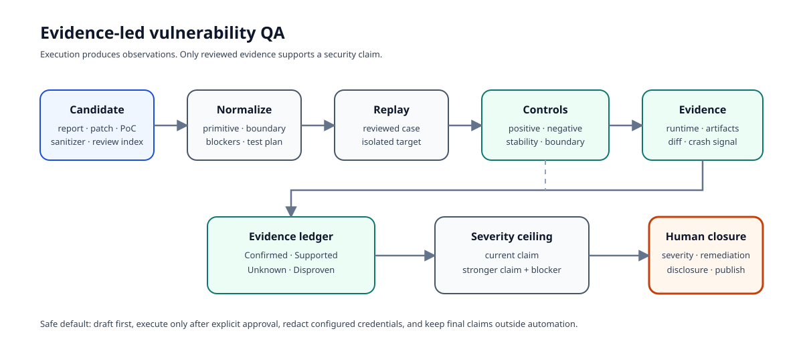

# Architecture

Security Research QA Harness separates report intake, controlled execution, evidence interpretation, and human sign-off. The separation matters because a command completing successfully is not vulnerability proof, and a crash is not automatically proof of exploitability.

## Processing stages

| Stage | Input | Output | Trust boundary |
| --- | --- | --- | --- |
| Intake | Ranked Markdown report or TOML case | Normalized finding set and draft cases | Analyst-supplied claims are untrusted hypotheses |
| Planning | Target profile, adapter, replay metadata | Explicit commands, variables, controls, collection paths | Generated commands require human review |
| Execution | Reviewed case in an isolated target | Exit state, redacted stdout/stderr, selected artifacts | Commands run only after an explicit execution flag |
| Boundary exploration | Base case and declarative axes | Controlled variants and artifact diffs | Variant count is bounded by the case definition |
| Evidence analysis | Runtime output and collected artifacts | Crash signals, runtime observations, memory-risk lens | Pattern classification is evidence support, not exploitability proof |
| Reporting | Structured analysis | Technical report and executive summary | Final severity and disclosure remain human decisions |

## Module map

| Module | Responsibility |
| --- | --- |
| `config.py`, `models.py` | TOML case parsing and structured contracts |
| `adapters.py` | Product and language defaults for files, services, APIs, libraries, JNI, native harnesses, and CLIs |
| `replay.py`, `executor.py` | Declarative request generation, explicit command execution, timeout handling, and secret redaction |
| `orchestration.py` | Target setup, service lifecycle, health checks, and cleanup |
| `boundary.py`, `diffing.py` | Bounded variants and comparison with the base replay |
| `analyzer.py`, `memory_lens.py`, `collectors.py` | Crash, runtime, allocator, adjacency, and exploitability-review cues |
| `intake.py`, `oss_workflow.py` | Ranked-report normalization, repository profiling, draft generation, and optional execution |
| `reporting.py` | Machine-readable, analyst, and leadership outputs |

## Execution boundary

Case files are executable specifications. `run` refuses to proceed without `--acknowledge-execution-risk`, and `triage-oss` drafts cases without running them unless `--execute` is supplied. These flags are intentional friction, not a sandbox. Run reviewed cases only against authorized targets in a disposable, credential-minimized environment such as [Agent Security Company](https://github.com/foxirain/agent-security-company).

Bearer tokens, cookies, and configured header values are redacted from stored commands, stdout, stderr, and `analysis.json`. Arbitrary target artifacts may still contain secrets, so artifact review is required before publication.
